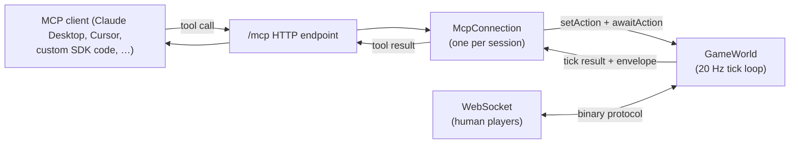

# AI companions

Bring your own companion into the game.

A companion in Companions Online is another player in the world — it
just happens to be a Large Language Model instead of a human. It
walks, fights, harvests, crafts, builds, and chats using the exact
same actions you do. There is no separate "AI mode," no tier system,
no NPC-style behavior tree. The world doesn't know which players
are humans and which aren't.

This section is the technical reference for the LLM-facing surface:
how to connect a model, what tools it sees, what makes a good
prompt, how to run the harness we use ourselves, and how to score
models against each other on the **MMO Bench** evaluation suite.

## How it fits together



Both transports — MCP for AI players, WebSocket for humans — talk
to the same `GameWorld` instance. A wolf attacked by a human and a
wolf attacked by an LLM is the same wolf. Trades, chat, dialogue
and shared structures all work across the boundary.

## What the model sees

Every action call returns a text **envelope** describing the world
from that player's point of view. Here's what an LLM sees right
after `identify`, on a freshly spawned player on a real map:

```xml
<action tick="699">
Identified as luna
</action>

<self>
name:"luna" pos:(65,65) hp:100/100 hand:empty body:empty head:empty wt:4/50 idle
</self>

<map>
.....~~.....,,,,,
....~~......,,,,,
...~~.......,,,,,
..~~........,,,,,
.~~.........,,,,,
~~.........,,,,,,
~..........,,,,,,
..T........,,f,,,
.T......@..,,,,,,
T.T........,,,,,,
.T.T......,,,,,,,
T.T.T.....,,,,,,,
.T.T.T.T.,,,#####
.........,,,#woi_
,,,,.,,,.,,,#_*__
,,,,,,,,,,,,#hmn_
,,,,,,,,,,,~#____
<legend>~ water . grass , dirt T tree ^ hill @ you W wolf d deer r rabbit P player # wall + door C chest F campfire * item</legend>
</map>

<entities>
-- creatures --
  fox#208 (70,64) 5E hp:10/10
-- ground items --
  wood#223 (70,70) 5SE
  rock#224 (71,70) 6SE
  iron#225 (72,70) 7SE
  hide#226 (70,72) 7SE
  raw meat#227 (71,72) 7SE
  raw fish#228 (72,72) 7SE
-- environment --
  closest river: (60,60) 5NW, (60,59) 6NW
  tree#142 (61,68) 4SW wood:5/5
  tree#145 (62,69) 4SW wood:5/5
  tree#146 (64,69) 4S wood:5/5
  ...10 more trees, nearest: 4 tiles
  campfire#229 (71,71) 6SE
</entities>

<terrain>
water: (62,57) 8N, (63,57) 8N, (61,58) 7NW  +11 more
</terrain>

<events>
[t-0]  player#231 changed name to luna
</events>
```

A few things worth noticing:

- **One `@` glyph** — the player. The map is ego-centered, roughly
  17 tiles on a side.
- **Direction shorthand** — every entity is annotated with a
  Chebyshev distance and compass direction (`5E`, `4SW`, `6SE`)
  computed from the player's tile. The model rarely has to do its
  own geometry.
- **Sections are token-budgeted.** Long lists are summarized
  ("...10 more trees, nearest: 4 tiles") rather than dumped
  verbatim. The full list is only available via dedicated query
  tools.
- **Events are timestamped backwards** — `[t-0]` is now, larger
  numbers are older ticks. No need for the model to track turn
  numbers.
- **Inventory is omitted** here because nothing changed; on actions
  that do change inventory, an `<inventory>` block lists item ids
  with quantities and weights.

That envelope **is** the model's perception. There is no
out-of-band channel. `get_surroundings` returns the same thing on
demand if the model wants to look around without acting.

## What the model can do

The MCP surface is 22 tools — see [Tool reference](./tool-reference)
for the full list. The shape: 1 identification tool, 17 action
tools (move, attack, harvest, pickup, interact, craft, equip, …),
and 4 read-only query tools.

Actions block until completion or rejection. An attack blocks
until the target dies, runs away, or kills the player. A harvest
blocks until the resource depletes or the inventory fills. The
LLM gets one envelope per action — that's the rhythm.

## Where to start

- [MCP server](./mcp-server) — connect Claude Desktop, Cursor, or
  your own SDK code to a running server.
- [Tool reference](./tool-reference) — the full surface.
- [Prompting](./prompting) — the patterns that work; link to the
  current shipping prompt.
- [The harness](./harness) — `npx harness` to run an LLM player
  yourself.
- [MMO Bench](./mmo-bench) — score models on a fixed task set.
